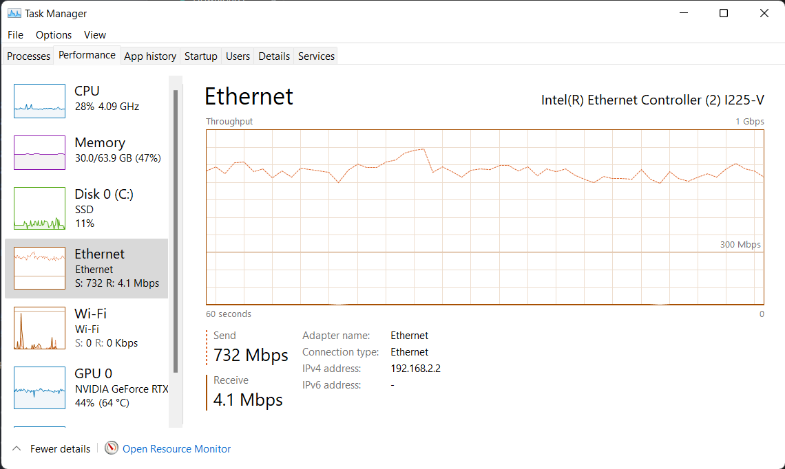
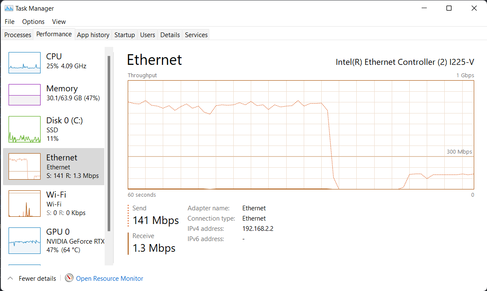

# FrameServer

Simple test for sending large(ish) files over websockets to a cowboy ws server.

# To Run

- requires Python 3

```
cd python
pip3 install -r requirements.txt
```

- asyncio
- argparse
- websockets

## Websockets

Cowboy WS Server

```
mix deps.get
iex -S mix
```

Python WS Server

```
cd python
python3 server.py --ip 192.168.2.1 --port 8765
```

Python WS Client

```
cd python
python3 client.py --server ws://192.168.2.1:8765
```

## Testing Results | Local, MacbookAir M1

`python client -> cowboy ws server`

```
λ python3 client.py
FPS = 8.72, websocket send time = 114.7ms
FPS = 8.86, websocket send time = 112.9ms
FPS = 7.96, websocket send time = 125.6ms
FPS = 8.28, websocket send time = 120.8ms
FPS = 8.72, websocket send time = 114.6ms
FPS = 8.90, websocket send time = 112.3ms
FPS = 8.87, websocket send time = 112.8ms
FPS = 8.80, websocket send time = 113.6ms
FPS = 8.86, websocket send time = 112.8ms
```

`python client -> python ws server`

```
λ python3 client.py
FPS = 594.26, websocket send time = 1.7ms
FPS = 820.32, websocket send time = 1.2ms
FPS = 555.24, websocket send time = 1.8ms
FPS = 628.55, websocket send time = 1.6ms
FPS = 491.83, websocket send time = 2.0ms
FPS = 232.19, websocket send time = 4.3ms
FPS = 274.35, websocket send time = 3.6ms
FPS = 693.04, websocket send time = 1.4ms
FPS = 483.10, websocket send time = 2.1ms
FPS = 344.25, websocket send time = 2.9ms
FPS = 492.40, websocket send time = 2.0ms
FPS = 443.65, websocket send time = 2.3ms
FPS = 307.59, websocket send time = 3.3ms
FPS = 555.17, websocket send time = 1.8ms
```

## Testing Results: Network | Win PC -> MacbookAir M1

- Gig ethernet, direct connection

`python client -> python ws server`

```
(base) C:\dev\pilotier\cowboy-ws-test\python>python client.py
FPS = 55.56, websocket send time = 18.0ms
FPS = 50.01, websocket send time = 20.0ms
FPS = 58.81, websocket send time = 17.0ms
FPS = 52.63, websocket send time = 19.0ms
FPS = 58.83, websocket send time = 17.0ms
FPS = 55.57, websocket send time = 18.0ms
FPS = 43.48, websocket send time = 23.0ms
FPS = 55.55, websocket send time = 18.0ms
FPS = 35.71, websocket send time = 28.0ms
FPS = 38.46, websocket send time = 26.0ms
FPS = 40.00, websocket send time = 25.0ms
FPS = 45.45, websocket send time = 22.0ms
FPS = 52.61, websocket send time = 19.0ms
FPS = 55.54, websocket send time = 18.0ms
FPS = 52.63, websocket send time = 19.0ms
FPS = 56.85, websocket send time = 17.6ms
FPS = 41.68, websocket send time = 24.0ms
FPS = 50.00, websocket send time = 20.0ms
FPS = 58.87, websocket send time = 17.0ms
FPS = 55.56, websocket send time = 18.0ms
FPS = 55.54, websocket send time = 18.0ms
```

Ethernet utilization ~= 730 Mbps



`python client -> cowboy ws server`

```
(base) C:\dev\cowboy-ws-test\python>python client.py
FPS = 8.62, websocket send time = 116.0ms
FPS = 8.55, websocket send time = 117.0ms
FPS = 8.70, websocket send time = 115.0ms
FPS = 8.33, websocket send time = 120.0ms
FPS = 8.55, websocket send time = 117.0ms
FPS = 8.93, websocket send time = 112.0ms
FPS = 7.04, websocket send time = 142.0ms
```

Ethernet utilization ~= 140 Mbps


